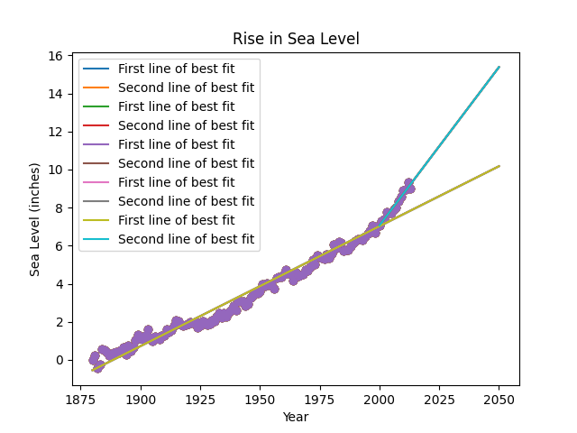

# Sea Level Predictor

This project is part of the **freeCodeCamp Data Analysis with Python**. It predicts the rise in global sea levels based on historical data from 1880 to the present. Using linear regression, it forecasts the sea level rise up to the year 2050.

## Overview

The dataset used in this project contains the global average sea level change since 1880. We use this data to:
- Create scatter plots of the data.
- Fit a line of best fit using linear regression over all data.
- Fit a second line of best fit starting from the year 2000 onward.
- Predict the sea level rise by the year 2050 based on both trends.

## Features

- **Scatter Plot**: Visualizes the raw data with years on the x-axis and sea levels (in inches) on the y-axis.
- **Line of Best Fit (All Data)**: A linear regression line using all available data points, extending to 2050.
- **Line of Best Fit (2000 Onward)**: A second linear regression line based only on data from 2000 onward, also extending to 2050.
- **Predictions for 2050**: Both regression lines predict sea level rise by the year 2050 based on their respective trends.

## Plot

